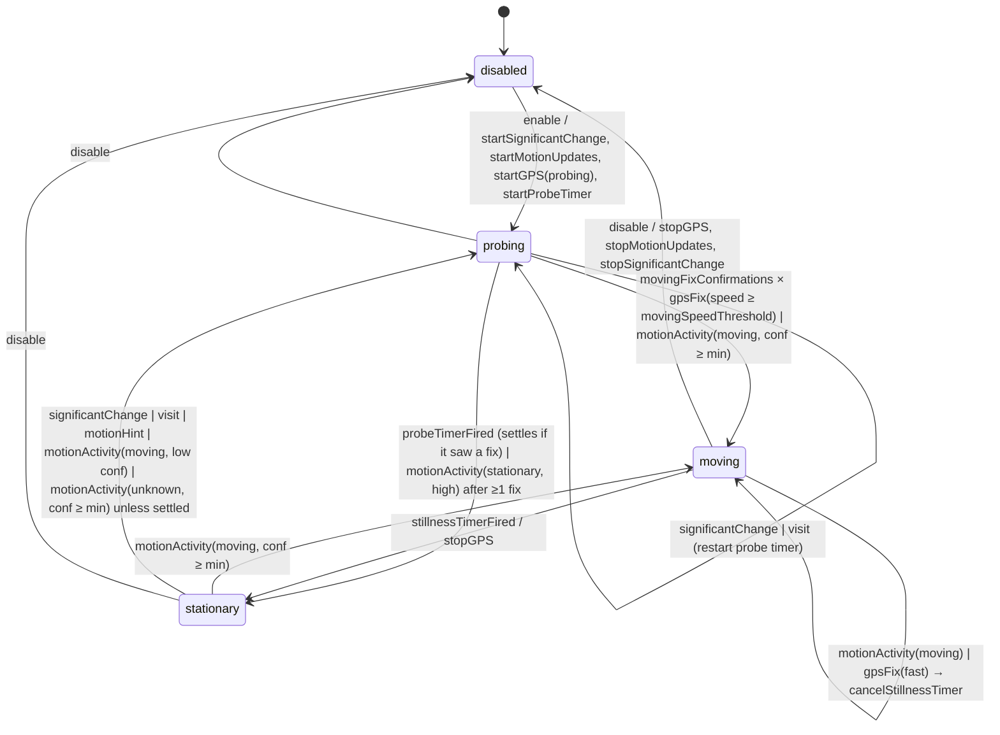

# WhereIWas — Architecture

iOS 17+ · iPhone only (`TARGETED_DEVICE_FAMILY = 1`) · SwiftUI · SwiftData · Swift 6 language mode (strict concurrency) · nine languages · one app target and a Swift Testing target, over three build configurations (Debug, Release, Screenshots — see §5.1).

Goal: record the best possible GPS history of a first responder over multi-day deployments, **reliably** (survives termination, reboot, offline), **accurately** (filtered samples with full metadata) and **without draining the battery** (GPS only runs while the device is actually moving).

---

## 1. Module map

```
WhereIWas/
  App/          WhereIWasApp (@main), AppDelegate (launch re-arming), AppEnvironment (composition root),
                ScreenshotMode + DemoTrackingController + DemoTracks (SCREENSHOTS only, see §5.1)
  Domain/       PURE Swift, no CoreLocation/CoreMotion/SwiftData import:
                ActivityKind, MotionEvent, GPSProfile, LocationFilter, TrackingSettings, UnitSystem,
                TrackingState (state machine), Interfaces (protocols + DTOs), Placeholders, TrackingEnvironment,
                AuditEvent (+ the AuditRecording protocol and NoopAuditLog), LocationFilterTrace
  Persistence/  @Model LocationSample / TrackingSession / StateTransitionLog / AuditEventLog,
                LocationStore (@ModelActor), GPXExporter, JSONExporter, AuditExporter
  Location/     LocationEngine (@MainActor, CLLocationManager owner), CLMapping, SimulatedLocationEngine
  Motion/       MotionMonitor (@MainActor, CMMotionActivityManager + CMPedometer + CMMotionManager bursts),
                CMMapping, SimulatedMotionMonitor
  Coordinator/  TrackingCoordinator (@MainActor @Observable) — runs the state machine, executes effects;
                AuditLog (the opt-in recorder — it owns OSLog and a LocationStoring, so it is not Domain);
                MaintenanceScheduler (BGProcessingTask registration + purge)
  UI/           RootView, StatusView, MapView, SettingsView, ExportView, AuditLogView,
                Formatting (localized display + unit system), TrackingStatusProviding
  Resources/    Localizable.xcstrings, InfoPlist.xcstrings (nine languages), PrivacyInfo.xcprivacy
WhereIWasTests/ Swift Testing suites
```

Dependency direction (strict):

```
UI ──▶ Domain ◀── Persistence
        ▲  ▲
        │  └── Location, Motion
        │
   Coordinator ──▶ Domain + Persistence + Location + Motion
   App ──▶ Coordinator (+ everything, it is the composition root)
```

Every module boundary is a protocol in `Domain/Interfaces.swift` plus `Sendable` value types. SwiftData `@Model` classes never leave the Persistence module. The UI never sees the coordinator type: it reads `@Environment(\.trackingController)` typed `any TrackingControlling`.

---

## 2. Data flow

```
CLLocationManager ─▶ LocationEngine ─┬─ LocationFilter (pure) ─▶ LocationSampleDraft ─▶ LocationStore (SQLite)
                                     └─ delegate ─▶ TrackingCoordinator ─▶ TrackingStateMachine.handle(.gpsFix)
CMMotionActivityManager ─▶ MotionMonitor ─▶ MotionEvent ─▶ TrackingCoordinator ─▶ handle(.motionActivity)
Timers (coordinator)                                     ─▶ handle(.stillnessTimerFired / .probeTimerFired)
Significant change / visit ─▶ LocationEngine delegate    ─▶ handle(.significantChange / .visit)
User toggle / launch re-arm                              ─▶ handle(.enable / .disable)

TrackingStateMachine.handle(input) -> [TrackingEffect]   (pure)
TrackingCoordinator.perform(effects)  -> LocationEngine.startGPS/stopGPS/startSignificantChangeMonitoring,
                                         MotionMonitor.start/stop, Task-based timers, LocationStore.logTransition
```

Sample annotation: for each accepted fix the engine calls `annotationProvider()` (set by the coordinator) to capture activity kind + confidence, phase, battery level/state, session id and the active profile label. So the engine writes complete rows without knowing about the state machine.

---

## 3. Motion-detection state machine (`Domain/TrackingState.swift`)

Pure `struct TrackingStateMachine` — inputs in, effects out, no clock, no frameworks. Timers are effects whose expiry comes back as inputs, so tests drive time explicitly.



### Phases

| Phase | GPS | Listening to |
|---|---|---|
| `disabled` | off | nothing |
| `stationary` | off — or `GPSProfile.stationaryCoarse` (3 km / 3000 m filter) when `keepCoarseUpdatesWhileStationary` | CoreMotion activity, pedometer, significant change, visits |
| `probing` | `GPSProfile.probing` (best, filter 0) for at most `probeTimeout` (45 s) | everything |
| `moving` | `GPSProfile.profile(for:speed:settings:)` | everything |

The status screen reads `TrackingStatus.appliedProfile` (the engine's `appliedProfile`), not `activeProfile`: in the coarse case CoreLocation is still running, so the row reads "Stationary (coarse)" and not "GPS off". `activeProfile` stays the high-accuracy profile, which is what annotates the samples.

### Rules
* **Toward MOVING is immediate** on a credible activity: `impliesMotion` and confidence ≥ `minimumActivityConfidence` (medium). GPS speed alone is slower on purpose: it takes `movingFixConfirmations` (2) **consecutive** probing fixes at ≥ `movingSpeedThreshold` (0.7 m/s), because CoreLocation occasionally puts a large speed on a fix that has not moved — one such reading used to be enough to start an `automotive` profile. Any slower or speed-less fix breaks the streak, as does leaving PROBING. The same confirmation gates the profile while MOVING: `profileSpeed` — the speed the table is fed, distinct from the raw `lastSpeed` the status screen shows — climbs a speed tier only once that many fixes agree, and falls back at the first slower fix (a tighter distance filter only costs precision we already have).
* **A confirmed settle silences the `unknown` rule.** `settledStationary` is set by a `stationary` activity at high confidence **outside MOVING**, and by a probe window that expired *after seeing at least one fix*; it is cleared by a motion hint, a significant change, a visit, any activity that `impliesMotion`, any fix at or above `movingSpeedThreshold`, and by `disable`. While set, a confidently `unknown` report no longer reopens PROBING: the classifier flaps between `stationary/low` and `unknown/high` while the phone sits still, and probing on every flap woke GPS 259 times in one recorded day.

  The three exclusions are not details. A phone lying on a car seat is genuinely stationary *to CoreMotion* while the car drives on, so settling from MOVING would silence the very reports that bring tracking back. A probe window that saw **no** fix (indoors, a parking garage, a cold receiver) is an absence of evidence in either direction, not evidence of stillness. And a measured GPS speed is a direct refutation of the guess the settle encodes.

  What this costs, stated plainly: while settled, the pedometer is the only *fast* way back, and it needs ten real steps (`TrackingCoordinator.motionHintStepThreshold`) — a driver who never walks depends on CoreMotion classifying `automotive`, or on a significant change (~500 m). That trade is the point of the rule; if it ever proves too coarse, the fix is a bound on how long a settle may last, not a return to probing on every flap.
* **Toward STATIONARY is hysteretic**: from MOVING only via the stillness timer (`stillnessTimeout`, 120 s default) which is armed by a credible `stationary` activity or a fix slower than `stillSpeedThreshold` (0.3 m/s) and cancelled by any moving activity or a fast fix (unless the classifier currently says stationary — GPS speed jitter must not defeat CoreMotion).
* **Significant change / visits never jump to MOVING**: they are ~500 m accuracy and also fire when *arriving*. They open a PROBING window; a real fix decides.
* **`enable` → PROBING**: on user toggle and on every relaunch we want a first fix and speed reading immediately.
* `startGPS(profile)` is re-emitted whenever the computed profile changes while MOVING (speed tier or activity changed); the engine diffs against `currentProfile` and reconfigures in place (no stop/start). The tier comes from `GPSProfile.speedTier` — `0` slow or unknown, `1` above 2.5 m/s, `2` above 7 m/s, `3` above 12.5 m/s — which is also what the confirmation above compares. The top tier carries no profile of its own for a slow label (2 and 3 both mean "vehicle" there); it exists so that a `cycling` label crossing 12.5 m/s, which *does* change the profile, is a tier change the machine acts on. `profileSpeed` follows every fix the machine sees, STATIONARY included (coarse updates still arrive there), so a drive's speed never leaks into the profile of the walk that follows.

### GPS profile table (`Domain/GPSProfile.swift`, pure)

| Activity | desiredAccuracy | distanceFilter | activityType |
|---|---|---|---|
| walking | best | 10 m | fitness |
| running / cycling, speed < 12.5 m/s | best | 20 m | fitness |
| automotive | bestForNavigation | 50 m | automotiveNavigation |
| unknown / stationary, no speed | best | 10 m | other |
| unknown, speed ≥ 2.5 m/s | best | 20 m | fitness |
| walking / unknown / stationary, speed ≥ 7 m/s | bestForNavigation | 50 m | automotiveNavigation (speed overrides a wrong label) |
| running / cycling, speed ≥ 12.5 m/s | bestForNavigation | 50 m | automotiveNavigation |

Probing: best / 0 m. Stationary coarse: threeKilometers / 3000 m.

Speed overrides a *slow* label at `vehicleSpeedThreshold` (7 m/s), because walking at 9 m/s is a vehicle
with a wrong label. `cycling` and `running` are not slow labels: 7 m/s is 25 km/h, a speed any cyclist
holds on the flat and doubles downhill, so applying that bar there put entire rides on the driving
profile — `bestForNavigation` and a 50 m filter, which drops most of a ride's shape. They keep their own
profile up to `cyclingVehicleSpeedThreshold` (12.5 m/s, 45 km/h), above which a bicycle label is wrong
often enough — a bike on a car rack, a classifier that has not caught up with the drive that just
started — that speed wins again.

### Sample filter (`Domain/LocationFilter.swift`, pure)
Check order: `horizontalAccuracy <= 0` → invalid; `> maxHorizontalAccuracy` (50 m) → poor; timestamp > 5 s in the future → future; older than `maxSampleAge` (30 s) → stale (CoreLocation replays cached fixes on `startUpdatingLocation`); not after previous accepted → outOfOrder; within `duplicateDistance` (0 m = identical coords) of previous → duplicate; latitude, longitude *and* `horizontalAccuracy` strictly equal to one of the last `LocationFilter.recentCapacity` (10) accepted fixes, with no valid speed → cachedRepeat (iOS replays a cached network fix with a fresh timestamp, which the previous-fix-only duplicate check misses whenever a real fix lands in between; `LocationEngine` keeps the ring, filled from GPS fixes only — `handleCoarse` neither runs the check nor feeds it, since an event fix is ~500 m wide and speed-less. A twin older than `LocationFilter.recentWindow` (600 s) no longer counts, so a receiver whose whole input is one repeated solution is never silenced indefinitely.) Every sample keeps latitude/longitude/altitude/h+v accuracy/speed/speedAccuracy/course/timestamp plus the annotation (activity, confidence, phase, battery level/state, session, profile label, source).

---

## 4. Persistence

SwiftData, SQLite on disk (`Application Support`), `ModelContainer` created once in `AppEnvironment` and handed to `LocationStore` (a `@ModelActor`). Models:

* `LocationSample` — `sequence: Int64` (`@Attribute(.unique)`, monotonically increasing; the store keeps the last value in memory after reading `max(sequence)` at init), all `LocationFix` fields, annotation fields (`activityRaw`, `activityConfidenceRaw`, `phaseRaw`, battery level/state, `profileLabel`), `sourceRaw`, `uploaded: Bool` (default false), `createdAt`, and a **denormalized** `sessionID: UUID?` — deliberately not a relationship, so purging thousands of rows never touches the session graph.
* `TrackingSession` — `id: UUID`, `startedAt`, `endedAt?`, cached `sampleCount` and `distanceMeters`, plus `lastLatitude` / `lastLongitude` (the previous point, so distance accrues incrementally on insert).
* `StateTransitionLog` — `id`, `timestamp`, `fromRaw`, `toRaw`, `reason`, `batteryLevel`.
* `AuditEventLog` — the opt-in audit trail (see §4.1): `id`, `timestamp`, `categoryRaw`, `severityRaw`, `name`, `argumentsRaw` (the code's parameters, joined by an ASCII unit separator), `detailsData` (one JSON blob — details are rendered and exported, never queried on), `phaseRaw`, `batteryLevel`.

The only index in the schema is the one SwiftData creates for `@Attribute(.unique) sequence` (and the same on `AuditEventLog.id`). Nothing else is indexed: the audit trail is filtered and sorted in memory by `LocationStore.auditEvents`, which is affordable because its retention is a week.

Upload-ready: `pendingUpload(limit:)` returns rows by ascending `sequence` with `uploaded == false`; `markUploaded(sequences:)` flips them. A future upload layer only needs these two calls. Writes are batched (`insertBatchSize`, 20) by the engine and flushed on state change, background transition, disable and before export. Purge: `purge(olderThan:)` runs from three places — a `BGProcessingTask` (`io.github.glandais.whereiwas.maintenance`), `MaintenanceScheduler.purgeAtLaunchIfNeeded()` on every bootstrap, and Settings on demand.

### 4.1 Audit trail (opt-in, off by default)

Answers "why is there no fix between 14:02 and 14:20?" after the fact. Three kinds of rows, all in `AuditEventLog`:

* **data received** — every fix, significant change and visit, with its raw coordinates, accuracy, speed and timestamp; every motion report;
* **tests performed** — `LocationFilter.trace(_:previous:now:settings:)` re-runs the filter recording each check (`horizontalAccuracy.withinLimit`, `timestamp.notStale`, …) with the measured value, the threshold and a verdict of passed / failed / skipped / not-applicable. the `LocationFilterTraceTests` suite (in `WhereIWasTests/AuditTrailTests.swift`) asserts the trace and `evaluate` agree over a grid of inputs, so the trail can never describe a decision the filter did not make;
* **decisions taken** — state transitions with their input and reason, every effect executed, GPS profile changes, permission changes, store writes, purges and exports.

Recording costs nothing when off: `AuditLog.record` takes an `@autoclosure`, so a disabled trail never even builds the event, and `LocationEngine` skips `trace` entirely (`evaluate` stays on the hot path). When on, events are buffered in a 400-event ring and written off the main actor in batches of 40 (`AuditLog.ringCapacity` / `flushBatchSize`), flushed on background.

An event carries **no prose**: `AuditEvent.name` is a stable code (`fix.rejected`, `effect.startGPS`) and `arguments` holds the parameters its sentence needs, formatted locale-independently (`["poorAccuracy", "88.0"]`). The store and both export formats write the code and its arguments; `Formatting.auditSummary` is the single place that turns them into a localized sentence for `AuditLogView`, falling back to the raw code for anything it does not know. `AuditSummaryTests` walks every producer and fails on a code with no sentence, since nothing in the compiler ties the two together.

The trail has its own switches and its own retention (`auditRetentionDays`, 7 days by default, purged by the same `BGProcessingTask`), because it turns over much faster than the samples. `AuditExporter` writes it as JSON (with the settings in force, so a reader knows what was being recorded) or plain text. `AuditLogView` reads it back, filtered by category and minimum severity.

Exports: `GPXExporter` (GPX 1.1, `<trkpt>` with `<ele>`, `<time>`, `<extensions>` for speed/course/accuracy/activity/battery) and `JSONExporter` (array of `StoredLocationSample`, ISO-8601 dates). The coordinator writes the file to `temporaryDirectory` and the UI shares it via `ShareLink`.

---

## 5. Background, termination, reboot — what iOS really does

Info.plist (generated from `project.yml`): `UIBackgroundModes = [location, processing]`, `NSLocationAlwaysAndWhenInUseUsageDescription`, `NSLocationWhenInUseUsageDescription`, `NSMotionUsageDescription`, `BGTaskSchedulerPermittedIdentifiers`, `ITSAppUsesNonExemptEncryption = false`. There is no `fetch` mode: the app registers a `BGProcessingTask` and no `BGAppRefreshTask`, and a declared-but-unused background mode is a free question at review time. Authorization must be **Always** (background tracking is impossible with When-In-Use once the app is suspended). The status screen shows the authorization and offers "Open Settings".

`LocationEngine` configuration:
* `allowsBackgroundLocationUpdates = true`, `pausesLocationUpdatesAutomatically = false` (the OS would otherwise silently pause updates when it decides the user is stationary, and never resume them until the app is foregrounded — that is exactly the decision we make ourselves, with a restart path).
* `showsBackgroundLocationIndicator = true` (honesty with the user; blue pill).
* A `CLBackgroundActivitySession` (iOS 17) is created in `startGPS` and invalidated in `stopGPS`. It keeps the process alive while GPS runs and, importantly, keeps "Always" location working even if the user chose "While using" then the app tries background — it is the iOS 17 way of declaring "we are doing background location on purpose".
* `startMonitoringSignificantLocationChanges()` and `startMonitoringVisits()` are always on while tracking is enabled. Both **relaunch a terminated app** (OS memory pressure, crash, or reboot once the device has been unlocked once) with `UIApplication.LaunchOptionsKey.location` in launch options.

### Relaunch contract (`AppDelegate` → `AppEnvironment` → `TrackingCoordinator`)
1. `application(_:didFinishLaunchingWithOptions:)` runs before any SwiftUI view is created. It synchronously calls `AppEnvironment.shared.bootstrap(launchedForLocation:)`.
2. `TrackingCoordinator.bootstrap(launchedForLocation:)` — not `init` — reads the persisted `UserDefaults` flag `whereiwas.trackingEnabled`. If set, it **synchronously** (same run-loop turn, before returning) creates the `CLLocationManager`, sets the delegate, calls `startMonitoringSignificantLocationChanges` + `startMonitoringVisits`, starts CoreMotion updates and feeds `.enable` to the state machine (→ PROBING → `startUpdatingLocation`). Creating the manager and starting updates in the same launch turn is required: the location event that caused the relaunch is delivered to a manager created during launch, and the app gets only a few seconds of background time otherwise.
3. If the app was launched for a location event but the flag is off (user disabled tracking, then the system still had a stale registration), the same method calls `engine.stopSignificantChangeMonitoring()` and `engine.stopGPS()` so the OS stops relaunching us.

### Honest limitations
* **Reboot**: nothing runs until the user unlocks the device once (data protection). After first unlock, significant-change/visit registrations survive the reboot and relaunch the app in the background on the first event. Between reboot and first unlock, and between unlock and the first significant change (≈500 m of movement or a visit), **no samples are recorded**. There is no API to change that.
* **Force quit by the user** (swipe up in the app switcher): iOS stops delivering background events until the user opens the app again. Surfaced in the UI: `TrackingStatus.isStale(now:threshold:)` warns when the last accepted fix is older than 30 minutes, alongside the other rows of `TrackingStatus.warnings`.
* **Stationary for long**: while STATIONARY we stop (or coarsen) GPS by design. If the process is later terminated, we depend on significant change / visit to relaunch. First movement after a long stop may lose up to ~500 m / a few minutes before PROBING starts. Keeping coarse updates on (`keepCoarseUpdatesWhileStationary`) makes the OS much less likely to terminate the process, so CoreMotion callbacks usually still arrive and the gap is small.
* **The system location indicator** (the blue pill around the clock) is on for as long as coarse updates run, i.e. permanently while tracking is enabled with `keepCoarseUpdatesWhileStationary`. `showsLocationIndicator` (default true) lets the user hide it; iOS shows it regardless while a `CLBackgroundActivitySession` is held, that is throughout PROBING and MOVING.
* **Low Power Mode / Background App Refresh off**: `BGProcessingTask` may never run (purge falls back to launch + Settings). Location background mode still works.
* **Precise location off** (`reducedAccuracy`): samples are ~1–3 km. The status screen flags it; we still record.
* **Motion permission denied**: the state machine only has GPS speed and significant change to work with. Coordinator falls back to `keepCoarseUpdatesWhileStationary = true` and a longer PROBING (`probeTimeout` × 2) — GPS is used more, battery suffers, tracking still works.
* Simulator: no background relaunch, no CoreMotion activity, no visits. Everything below "how to test" is device-only.

### Battery strategy summary
GPS at best accuracy costs roughly 8–12 %/h; CoreMotion activity updates, pedometer, significant change and visits are essentially free (the motion coprocessor). So: GPS only in MOVING/PROBING, profile scaled to speed (a car does not need a 10 m filter), 120 s stillness hysteresis to avoid flapping at traffic lights, coarse updates while stationary. Expected: a responder walking 3 h and driving 2 h in a 12 h shift ≈ 40–50 % battery for tracking.


### 5.1 Screenshot mode (`SCREENSHOTS`, never in a Release binary)

App Store captures need screens full of plausible history, which a simulator with no GPS and no
CoreMotion cannot produce. So a whole second app exists behind one compilation condition:

* `project.yml` declares a **`Screenshots`** configuration (a Debug clone with
  `SWIFT_ACTIVE_COMPILATION_CONDITIONS: "DEBUG SCREENSHOTS"`) and a `WhereIWas-Screenshots`
  scheme. Release never sets the condition — verify with
  `xcodebuild -configuration Release -showBuildSettings | grep SWIFT_ACTIVE_COMPILATION_CONDITIONS`.
* `App/ScreenshotMode.swift` reads `-screenshotMode` / `-screenshotScreen` / `-screenshotScenario`
  out of `UserDefaults`' `NSArgumentDomain`, so `simctl launch` sets them with no parsing. One
  launch per capture, landing straight on the right tab: the script never has to find a tab by a
  label that differs in nine languages.
* `AppDelegate` returns before `bootstrap` and before `didEnterBackground`
  (`AppDelegate.swift:15-29`), which keeps `CLLocationManager`, the permission prompts, the BGTask
  registration and the on-disk store out of the way entirely.
* `WhereIWasApp` injects a `DemoTrackingController` (a full `TrackingControlling` over
  `DemoTracks` fixtures — real streets in nine cities) in place of the coordinator.
* `DemoTracks.swift` is compiled **a second time** into the test target with the condition on
  (`project.yml:87-105`), because `@testable import WhereIWas` links the Debug app, where the `#if`
  has stripped the file to nothing. No duplicate symbol results: the app target never builds the
  Screenshots configuration alongside the tests.

The capture pipeline itself (`scripts/screenshots.sh` → `kou generate` → `screenshots/assemble.sh`)
is documented in `screenshots/README.md`.

---

## 6. Concurrency model

* `LocationEngine`, `MotionMonitor`, `TrackingCoordinator`: `@MainActor final class`. CoreLocation/CoreMotion deliver on the main queue (we pass `.main` as the operation queue). Cheap work only; no heavy computation on main.
* `LocationStore`: `@ModelActor`; all persistence async; DTO values in and out.
* Timers in the coordinator are `Task { try await Task.sleep(for:) ; handle(.stillnessTimerFired) }` stored and cancelled on `cancelStillnessTimer`. On the device, `Task.sleep` keeps working while the process lives; when the app is suspended the task simply resumes late, which is fine (the state machine tolerates late timer inputs because they are ignored when the phase changed; the `armed` flags guard staleness).
* Domain types are all `Sendable` values.
* No `@unchecked Sendable`, no `nonisolated(unsafe)`.

---

## 7. How to test

Unit (simulator, `./scripts/xcb.sh test`): state machine transitions and effects; GPS profile table; filter; `LocationStore` with an in-memory `ModelContainer` (`isStoredInMemoryOnly: true`); GPX/JSON exporters; audit trail (trace-vs-filter equivalence, opt-in and severity gating, store round-trip, its own retention, export formats); `TrackingSettings` coding and clamping; `Formatting` (including the unit system); `MotionMonitor` mapping, debouncing and burst analysis; `DemoTracks` (the SCREENSHOTS fixtures, compiled into the test target too).

Not covered: there is no suite for `TrackingCoordinator` itself, although `SimulatedLocationEngine` and `SimulatedMotionMonitor` exist to make one writable.

Device (mandatory for background behaviour):
1. Install a Debug build, grant Always + Precise + Motion.
2. Enable tracking, lock the phone, walk 10 min, drive 10 min, sit 10 min. Check the transition log in the Status screen: probing → moving (walking) → moving (automotive) → stationary after 120 s.
3. Termination: with tracking on, run `xcrun devicectl device process terminate` (or let iOS kill it by opening a few heavy apps), then move > 500 m. The app must relaunch (Console.app filter `subsystem:io.github.glandais.whereiwas`) and a `enable/relaunch` transition appears.
4. Reboot: reboot, unlock once, leave the app closed, move > 500 m: same expectation.
5. Force quit: swipe the app away, move: nothing should be recorded (expected iOS behaviour); reopen the app: tracking resumes automatically.
6. Battery: Settings › Battery after a full day; compare with `keepCoarseUpdatesWhileStationary` on/off.
7. Idle noise: with the trail on, leave the phone still on a table for an hour, then export. `state.transition` rows with `reason=activity unknown/high` should be rare (they used to be the bulk of the day), no transition to MOVING may cite a single speed reading, and `rejection=cachedRepeat` is where the replayed fix now goes.
8. Audit trail: turn it on in Settings, repeat step 2, then open Settings › Audit trail. Every gap in the samples must be explained by an event — a rejected fix with the check that failed, a stop-GPS effect, or a permission change. Export it and check the file opens outside the app.

---

## 8. Conventions

`UserDefaults` keys: `whereiwas.trackingEnabled` (Bool), `whereiwas.settings.v1` (JSON, via
`TrackingSettings.load/save`). BGTask id: `io.github.glandais.whereiwas.maintenance`. os_log
subsystem: `io.github.glandais.whereiwas`, categories `engine`, `motion`, `coordinator`, `store`, `audit`.

`Domain/Placeholders.swift` (`InMemoryLocationStore`, `NoopLocationEngine`, `NoopMotionMonitor`,
`NoopTrackingController`) is used in previews and tests, with three more doubles alongside it:
`SimulatedLocationEngine` and `SimulatedMotionMonitor` (scripted fixes and activities, in their own
modules), `PreviewTrackingController` (`UI/TrackingStatusProviding.swift`) and `NoopAuditLog`
(`Domain/AuditEvent.swift`).

Localization: nine languages (en source, fr, de, es, it, ja, nl, pl, cs) through
`Resources/Localizable.xcstrings` and `InfoPlist.xcstrings`, listed in `knownRegions`. Keys are
dotted names, never the English sentence, and are never shared across two subjects — see the
Localization section of `CLAUDE.md` for the rules and the `./scripts/xcb.sh strings` workflow.
Distances, speeds and altitudes follow `TrackingSettings.unitSystem` (metric / imperial, defaulting
from the device locale), not the display language: `Formatting` holds the choice in a static the UI
pushes to.
