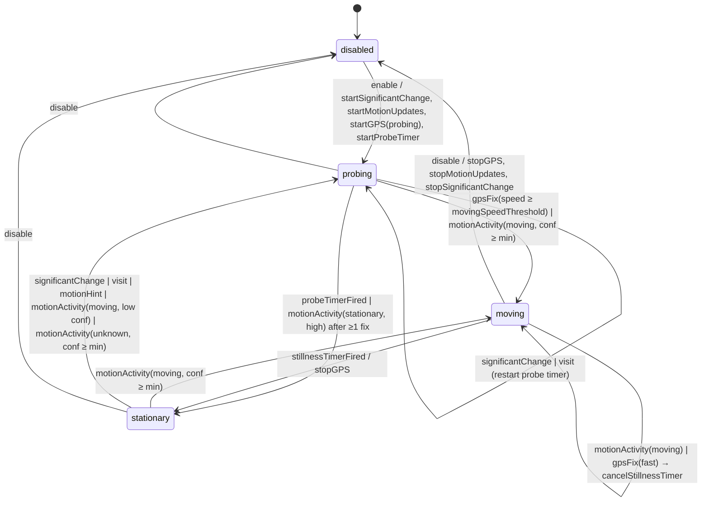

# WhereIWas — Architecture

iOS 17+ · SwiftUI · SwiftData · Swift 6 language mode (strict concurrency) · single app target + Swift Testing target.

Goal: record the best possible GPS history of a first responder over multi-day deployments, **reliably** (survives termination, reboot, offline), **accurately** (filtered samples with full metadata) and **without draining the battery** (GPS only runs while the device is actually moving).

---

## 1. Module map

```
WhereIWas/
  App/          WhereIWasApp (@main), AppDelegate (launch re-arming), AppEnvironment (composition root)
  Domain/       PURE Swift, no CoreLocation/CoreMotion/SwiftData import:
                ActivityKind, MotionEvent, GPSProfile, LocationFilter, TrackingSettings,
                TrackingState (state machine), Interfaces (protocols + DTOs), Placeholders, TrackingEnvironment,
                AuditEvent, LocationFilterTrace (per-fix validation record), AuditLog (opt-in recorder)
  Persistence/  @Model LocationSample / TrackingSession / StateTransitionLog / AuditEventRecord,
                LocationStore (@ModelActor), GPXExporter, JSONExporter, AuditExporter
  Location/     LocationEngine (@MainActor, CLLocationManager owner)
  Motion/       MotionMonitor (@MainActor, CMMotionActivityManager + CMPedometer + CMMotionManager bursts)
  Coordinator/  TrackingCoordinator (@MainActor @Observable) — runs the state machine, executes effects
  UI/           RootView, StatusView, MapView, SettingsView, ExportView, AuditLogView
WhereIWasTests/ Swift Testing suites
```

Dependency direction (strict):

```
UI ──▶ Domain ◀── Persistence
        ▲  ▲
        │  └── Location, Motion
        │
   Coordinator ──▶ Domain + Persistence + Location + Motion
   App ──▶ Coordinator (+ everything, it is the composition root)
```

Every module boundary is a protocol in `Domain/Interfaces.swift` plus `Sendable` value types. SwiftData `@Model` classes never leave the Persistence module. The UI never sees the coordinator type: it reads `@Environment(\.trackingController)` typed `any TrackingControlling`.

---

## 2. Data flow

```
CLLocationManager ─▶ LocationEngine ─┬─ LocationFilter (pure) ─▶ LocationSampleDraft ─▶ LocationStore (SQLite)
                                     └─ delegate ─▶ TrackingCoordinator ─▶ TrackingStateMachine.handle(.gpsFix)
CMMotionActivityManager ─▶ MotionMonitor ─▶ MotionEvent ─▶ TrackingCoordinator ─▶ handle(.motionActivity)
Timers (coordinator)                                     ─▶ handle(.stillnessTimerFired / .probeTimerFired)
Significant change / visit ─▶ LocationEngine delegate    ─▶ handle(.significantChange / .visit)
User toggle / launch re-arm                              ─▶ handle(.enable / .disable)

TrackingStateMachine.handle(input) -> [TrackingEffect]   (pure)
TrackingCoordinator.perform(effects)  -> LocationEngine.startGPS/stopGPS/startSignificantChangeMonitoring,
                                         MotionMonitor.start/stop, Task-based timers, LocationStore.logTransition
```

Sample annotation: for each accepted fix the engine calls `annotationProvider()` (set by the coordinator) to capture activity kind + confidence, phase, battery level/state, session id and the active profile label. So the engine writes complete rows without knowing about the state machine.

---

## 3. Motion-detection state machine (`Domain/TrackingState.swift`)

Pure `struct TrackingStateMachine` — inputs in, effects out, no clock, no frameworks. Timers are effects whose expiry comes back as inputs, so tests drive time explicitly.



### Phases

| Phase | GPS | Listening to |
|---|---|---|
| `disabled` | off | nothing |
| `stationary` | off — or `GPSProfile.stationaryCoarse` (3 km / 3000 m filter) when `keepCoarseUpdatesWhileStationary` | CoreMotion activity, pedometer, significant change, visits |
| `probing` | `GPSProfile.probing` (best, filter 0) for at most `probeTimeout` (45 s) | everything |
| `moving` | `GPSProfile.profile(for:speed:settings:)` | everything |

### Rules
* **Toward MOVING is immediate** on credible evidence: activity with `impliesMotion` and confidence ≥ `minimumActivityConfidence` (medium), or a probing fix at ≥ `movingSpeedThreshold` (0.7 m/s).
* **Toward STATIONARY is hysteretic**: from MOVING only via the stillness timer (`stillnessTimeout`, 120 s default) which is armed by a credible `stationary` activity or a fix slower than `stillSpeedThreshold` (0.3 m/s) and cancelled by any moving activity or a fast fix (unless the classifier currently says stationary — GPS speed jitter must not defeat CoreMotion).
* **Significant change / visits never jump to MOVING**: they are ~500 m accuracy and also fire when *arriving*. They open a PROBING window; a real fix decides.
* **`enable` → PROBING**: on user toggle and on every relaunch we want a first fix and speed reading immediately.
* `startGPS(profile)` is re-emitted whenever the computed profile changes while MOVING (speed tier or activity changed); the engine diffs against `currentProfile` and reconfigures in place (no stop/start).

### GPS profile table (`Domain/GPSProfile.swift`, pure)

| Activity | desiredAccuracy | distanceFilter | activityType |
|---|---|---|---|
| walking | best | 10 m | fitness |
| running / cycling | best | 20 m | fitness |
| automotive | bestForNavigation | 50 m | automotiveNavigation |
| unknown / stationary, no speed | best | 10 m | other |
| unknown, speed ≥ 2.5 m/s | best | 20 m | fitness |
| any, speed ≥ 7 m/s | bestForNavigation | 50 m | automotiveNavigation (speed overrides a wrong label) |

Probing: best / 0 m. Stationary coarse: threeKilometers / 3000 m.

### Sample filter (`Domain/LocationFilter.swift`, pure)
Check order: `horizontalAccuracy <= 0` → invalid; `> maxHorizontalAccuracy` (50 m) → poor; timestamp > 5 s in the future → future; older than `maxSampleAge` (30 s) → stale (CoreLocation replays cached fixes on `startUpdatingLocation`); not after previous accepted → outOfOrder; within `duplicateDistance` (0 m = identical coords) of previous → duplicate. Every sample keeps latitude/longitude/altitude/h+v accuracy/speed/speedAccuracy/course/timestamp plus the annotation (activity, confidence, phase, battery level/state, session, profile label, source).

---

## 4. Persistence

SwiftData, SQLite on disk (`Application Support`), `ModelContainer` created once in `AppEnvironment` and handed to `LocationStore` (a `@ModelActor`). Models:

* `LocationSample` — `sequence: Int64` (`@Attribute(.unique)`, monotonically increasing; the store keeps the last value in memory after reading `max(sequence)` at init), all `LocationFix` fields, annotation fields (activity/confidence/phase raw values, battery level/state, profile label), `source`, `uploaded: Bool` (indexed, default false), `createdAt`, optional `session` relationship.
* `TrackingSession` — `id: UUID`, `startedAt`, `endedAt?`, cached `sampleCount` and `distanceMeters` (updated on insert).
* `StateTransitionLog` — `id`, `timestamp`, `from`, `to`, `reason`, `batteryLevel`.
* `AuditEventRecord` — the opt-in audit trail (see §4.1): `timestamp` (indexed), `category`, `severityRank` (indexed, so "warnings and above" is a range query), `name`, `message`, JSON-encoded `details`, `phase`, `batteryLevel`.

Upload-ready: `pendingUpload(limit:)` returns rows by ascending `sequence` with `uploaded == false`; `markUploaded(sequences:)` flips them. A future upload layer only needs these two calls. Writes are batched (`insertBatchSize`, 20) by the engine and flushed on state change, background transition, disable and before export. Purge: `purge(olderThan:)` runs from a `BGProcessingTask` (`io.github.glandais.whereiwas.maintenance`) and from Settings.

### 4.1 Audit trail (opt-in, off by default)

Answers "why is there no fix between 14:02 and 14:20?" after the fact. Three kinds of rows, all in `AuditEventRecord`:

* **data received** — every fix, significant change and visit, with its raw coordinates, accuracy, speed and timestamp; every motion report;
* **tests performed** — `LocationFilter.trace(_:previous:now:settings:)` re-runs the filter recording each check (`horizontalAccuracy.withinLimit`, `timestamp.notStale`, …) with the measured value, the threshold and a verdict of passed / failed / skipped / not-applicable. `LocationFilterTraceTests` asserts the trace and `evaluate` agree over a grid of inputs, so the trail can never describe a decision the filter did not make;
* **decisions taken** — state transitions with their input and reason, every effect executed, GPS profile changes, permission changes, store writes, purges and exports.

Recording costs nothing when off: `AuditLog.record` takes an `@autoclosure`, so a disabled trail never even builds the event, and `LocationEngine` skips `trace` entirely (`evaluate` stays on the hot path). When on, events are buffered in memory (256 max) and written in batches off the main actor, flushed on background.

The trail has its own switches and its own retention (`auditRetentionDays`, 7 days by default, purged by the same `BGProcessingTask`), because it turns over much faster than the samples. `AuditExporter` writes it as JSON (with the settings in force, so a reader knows what was being recorded) or plain text. `AuditLogView` reads it back, filtered by category and minimum severity.

Exports: `GPXExporter` (GPX 1.1, `<trkpt>` with `<ele>`, `<time>`, `<extensions>` for speed/course/accuracy/activity/battery) and `JSONExporter` (array of `StoredLocationSample`, ISO-8601 dates). The coordinator writes the file to `temporaryDirectory` and the UI shares it via `ShareLink`.

---

## 5. Background, termination, reboot — what iOS really does

Info.plist: `UIBackgroundModes = [location, processing, fetch]`, `NSLocationAlwaysAndWhenInUseUsageDescription`, `NSMotionUsageDescription`, `BGTaskSchedulerPermittedIdentifiers`. Authorization must be **Always** (background tracking is impossible with When-In-Use once the app is suspended). The status screen shows the authorization and offers "Open Settings".

`LocationEngine` configuration:
* `allowsBackgroundLocationUpdates = true`, `pausesLocationUpdatesAutomatically = false` (the OS would otherwise silently pause updates when it decides the user is stationary, and never resume them until the app is foregrounded — that is exactly the decision we make ourselves, with a restart path).
* `showsBackgroundLocationIndicator = true` (honesty with the user; blue pill).
* A `CLBackgroundActivitySession` (iOS 17) is created in `startGPS` and invalidated in `stopGPS`. It keeps the process alive while GPS runs and, importantly, keeps "Always" location working even if the user chose "While using" then the app tries background — it is the iOS 17 way of declaring "we are doing background location on purpose".
* `startMonitoringSignificantLocationChanges()` and `startMonitoringVisits()` are always on while tracking is enabled. Both **relaunch a terminated app** (OS memory pressure, crash, or reboot once the device has been unlocked once) with `UIApplication.LaunchOptionsKey.location` in launch options.

### Relaunch contract (`AppDelegate` → `AppEnvironment` → `TrackingCoordinator`)
1. `application(_:didFinishLaunchingWithOptions:)` runs before any SwiftUI view is created. It synchronously calls `AppEnvironment.shared.bootstrap(launchedForLocation:)`.
2. `TrackingCoordinator.init` reads the persisted `UserDefaults` flag `whereiwas.trackingEnabled`. If set, it **synchronously** (same run-loop turn, before returning) creates the `CLLocationManager`, sets the delegate, calls `startMonitoringSignificantLocationChanges` + `startMonitoringVisits`, starts CoreMotion updates and feeds `.enable` to the state machine (→ PROBING → `startUpdatingLocation`). Creating the manager and starting updates in the same launch turn is required: the location event that caused the relaunch is delivered to a manager created during launch, and the app gets only a few seconds of background time otherwise.
3. If the app was launched for a location event but the flag is off (user disabled tracking, then the system still had a stale registration), the coordinator explicitly calls `stopMonitoringSignificantLocationChanges` / `stopMonitoringVisits` so the OS stops relaunching us.

### Honest limitations
* **Reboot**: nothing runs until the user unlocks the device once (data protection). After first unlock, significant-change/visit registrations survive the reboot and relaunch the app in the background on the first event. Between reboot and first unlock, and between unlock and the first significant change (≈500 m of movement or a visit), **no samples are recorded**. There is no API to change that.
* **Force quit by the user** (swipe up in the app switcher): iOS stops delivering background events until the user opens the app again. Document this in the UI (Status screen shows "tracking armed since …" and a warning if last sample is older than N minutes).
* **Stationary for long**: while STATIONARY we stop (or coarsen) GPS by design. If the process is later terminated, we depend on significant change / visit to relaunch. First movement after a long stop may lose up to ~500 m / a few minutes before PROBING starts. Keeping coarse updates on (`keepCoarseUpdatesWhileStationary`) makes the OS much less likely to terminate the process, so CoreMotion callbacks usually still arrive and the gap is small.
* **Low Power Mode / Background App Refresh off**: `BGProcessingTask` may never run (purge falls back to launch + Settings). Location background mode still works.
* **Precise location off** (`reducedAccuracy`): samples are ~1–3 km. The status screen flags it; we still record.
* **Motion permission denied**: the state machine only has GPS speed and significant change to work with. Coordinator falls back to `keepCoarseUpdatesWhileStationary = true` and a longer PROBING (`probeTimeout` × 2) — GPS is used more, battery suffers, tracking still works.
* Simulator: no background relaunch, no CoreMotion activity, no visits. Everything below "how to test" is device-only.

### Battery strategy summary
GPS at best accuracy costs roughly 8–12 %/h; CoreMotion activity updates, pedometer, significant change and visits are essentially free (the motion coprocessor). So: GPS only in MOVING/PROBING, profile scaled to speed (a car does not need a 10 m filter), 120 s stillness hysteresis to avoid flapping at traffic lights, coarse updates while stationary. Expected: a responder walking 3 h and driving 2 h in a 12 h shift ≈ 40–50 % battery for tracking.

---

## 6. Concurrency model

* `LocationEngine`, `MotionMonitor`, `TrackingCoordinator`: `@MainActor final class`. CoreLocation/CoreMotion deliver on the main queue (we pass `.main` as the operation queue). Cheap work only; no heavy computation on main.
* `LocationStore`: `@ModelActor`; all persistence async; DTO values in and out.
* Timers in the coordinator are `Task { try await Task.sleep(for:) ; handle(.stillnessTimerFired) }` stored and cancelled on `cancelStillnessTimer`. On the device, `Task.sleep` keeps working while the process lives; when the app is suspended the task simply resumes late, which is fine (the state machine tolerates late timer inputs because they are ignored when the phase changed; the `armed` flags guard staleness).
* Domain types are all `Sendable` values.
* No `@unchecked Sendable`, no `nonisolated(unsafe)`.

---

## 7. How to test

Unit (simulator, `xcodebuild test`): state machine transitions and effects; GPS profile table; filter; `LocationStore` with an in-memory `ModelContainer` (`isStoredInMemoryOnly: true`); GPX/JSON exporters; audit trail (trace-vs-filter equivalence, opt-in and severity gating, store round-trip, its own retention, export formats).

Device (mandatory for background behaviour):
1. Install a Debug build, grant Always + Precise + Motion.
2. Enable tracking, lock the phone, walk 10 min, drive 10 min, sit 10 min. Check the transition log in the Status screen: probing → moving (walking) → moving (automotive) → stationary after 120 s.
3. Termination: with tracking on, run `xcrun devicectl device process terminate` (or let iOS kill it by opening a few heavy apps), then move > 500 m. The app must relaunch (Console.app filter `subsystem:io.github.glandais.whereiwas`) and a `enable/relaunch` transition appears.
4. Reboot: reboot, unlock once, leave the app closed, move > 500 m: same expectation.
5. Force quit: swipe the app away, move: nothing should be recorded (expected iOS behaviour); reopen the app: tracking resumes automatically.
6. Battery: Settings › Battery after a full day; compare with `keepCoarseUpdatesWhileStationary` on/off.
7. Audit trail: turn it on in Settings, repeat step 2, then open Settings › Audit trail. Every gap in the samples must be explained by an event — a rejected fix with the check that failed, a stop-GPS effect, or a permission change. Export it and check the file opens outside the app.

---

## 8. CONTRACT — file ownership for parallel agents

The scaffold (this document, `project.yml`, `WhereIWas/Domain/*`) is frozen. Module agents own **only** the files below, may add files in their own directory, and must not edit another module's files. If an interface is insufficient, implement a superset in your own type and note it in your result; the integrator (Coordinator+App agent) reconciles. Run `xcodegen generate` after adding files.

| Agent | Owns (create/replace) | Depends on |
|---|---|---|
| **Persistence** | `WhereIWas/Persistence/Models.swift` (`LocationSample`, `TrackingSession`, `StateTransitionLog` as `@Model`), `WhereIWas/Persistence/LocationStore.swift` (`@ModelActor actor LocationStore: LocationStoring`, `init(modelContainer:)`, plus `static func makeContainer(inMemory: Bool) throws -> ModelContainer`), `WhereIWas/Persistence/GPXExporter.swift` (`enum GPXExporter { static func export(_ samples: [StoredLocationSample], name: String) -> String }`), `WhereIWas/Persistence/JSONExporter.swift` (`enum JSONExporter { static func export(_ samples: [StoredLocationSample]) throws -> Data }`) | Domain |
| **Location** | `WhereIWas/Location/LocationEngine.swift` (`@MainActor final class LocationEngine: NSObject, LocationEngineProtocol`, `init(store: any LocationStoring, settings: TrackingSettings)`), `WhereIWas/Location/CLMapping.swift` (AccuracyLevel/ActivityTypeHint/CLAuthorizationStatus ↔ CoreLocation, `CLLocation → LocationFix`) | Domain |
| **Motion** | `WhereIWas/Motion/MotionMonitor.swift` (`@MainActor final class MotionMonitor: MotionMonitoring`, `init()`), `WhereIWas/Motion/CMMapping.swift` | Domain |
| **Coordinator + App** | `WhereIWas/Coordinator/TrackingCoordinator.swift` (`@MainActor @Observable final class TrackingCoordinator: TrackingControlling, LocationEngineDelegate`, `init(store:engine:motion:settings:defaults:)`, `func bootstrap(launchedForLocation:)`), `WhereIWas/Coordinator/MaintenanceScheduler.swift` (BGTaskScheduler), `WhereIWas/App/AppEnvironment.swift`, `WhereIWas/App/AppDelegate.swift`, `WhereIWas/App/WhereIWasApp.swift` (replace the placeholders; keep `\.trackingController` injection) | everything |
| **UI** | `WhereIWas/UI/RootView.swift` (replace placeholder with TabView), `StatusView.swift`, `MapView.swift`, `SettingsView.swift`, `ExportView.swift`, `WhereIWas/UI/Formatting.swift` | Domain only — use `@Environment(\.trackingController)`; previews use `NoopTrackingController` |
| **Tests** | `WhereIWasTests/TrackingStateTests.swift`, `GPSProfileTests.swift`, `LocationFilterTests.swift`, `LocationStoreTests.swift` (uses `LocationStore.makeContainer(inMemory: true)`), `GPXExporterTests.swift`; may delete `ScaffoldTests.swift` | Domain + Persistence |

Persisted keys (owned by Coordinator): `UserDefaults` `whereiwas.trackingEnabled` (Bool), `whereiwas.settings.v1` (JSON, via `TrackingSettings.load/save`). BGTask id: `io.github.glandais.whereiwas.maintenance`. os_log subsystem: `io.github.glandais.whereiwas`, categories `engine`, `motion`, `coordinator`, `store`.

`Domain/Placeholders.swift` (`InMemoryLocationStore`, `NoopLocationEngine`, `NoopMotionMonitor`, `NoopTrackingController`) stays and may be used in previews and tests.
